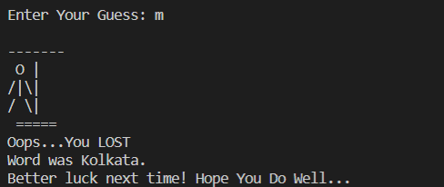

# Hangman_GAME
- Hangman is a guessing game for two or more players. One player thinks of a word, phrase or sentence and the other(s) tries to guess it by suggesting letters within a certain number of guesses. 
Here I have created "Guess The City"_Edition of the same...you'll be having to guess the name of different cities randomly chose by the game.
## Technologies Used
 - Python3
## How It Works??

- Every time you run the game a new random word is chosen to guess.
- You have only 6 chances to make wrong guesses.

##  How to Configure:
1. Installing pip [Python Package Manager]

-  $ sudo apt-get install python3-pip

2.Clone this repository to your local drive

$ git clone https://github.com/Meghaanil/Hangman_GAME.git
